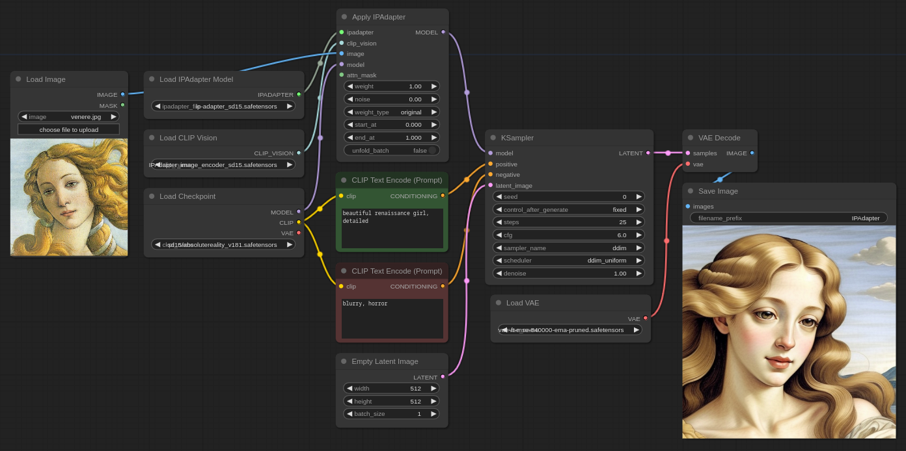

# ComfyUI IPAdapter plus
[ComfyUI](https://github.com/comfyanonymous/ComfyUI) reference implementation for [IPAdapter](https://github.com/tencent-ailab/IP-Adapter/) models.

IPAdapter implementation that follows the ComfyUI way of doing things. The code is memory efficient, fast, and shouldn't break with Comfy updates.

## Updates

**2023/9/27**: Added a `PrepImageForClipVision` to prepare your images for IPAdapters and get generally better results. See below for details. Note that this is useful for any clip vision encoded image, not only IPAdapter.

**2023/9/17**: Better image handling, lower memory usage. Changed how the noise is generated.

**2023/9/15**: Huge code cleanup! I streamlined the node structure for a tidier workflow. **IMPORTANT** this is a breaking update, we don't need the dedicated clip vision encoder anymore. Please check the new included workflows. Also introduced the new `noise` option, see below for details.

**2023/9/11**: The code has been rewritten to take advantage of the new ComfyUI updates regarding clip vision. Expect lower memory usage.

## What is it?

The IPAdapter are very powerful models for image-to-image conditioning. Given a reference image you can do variations augmented by text prompt, controlnets and masks. Think of it as a 1-image lora.

## Example workflow

## Installation

Download or git clone this repository inside `ComfyUI/custom_nodes/` directory.

The pre-trained models are available on [huggingface](https://huggingface.co/h94/IP-Adapter), download and place them in the `ComfyUI/custom_nodes/ComfyUI_IPAdapter_plus/models` directory.

For SD1.5 you need:

- [ip-adapter_sd15.bin](https://huggingface.co/h94/IP-Adapter/resolve/main/models/ip-adapter_sd15.bin)
- [ip-adapter_sd15_light.bin](https://huggingface.co/h94/IP-Adapter/blob/main/models/ip-adapter_sd15_light.bin)
- [ip-adapter-plus_sd15.bin](https://huggingface.co/h94/IP-Adapter/resolve/main/models/ip-adapter-plus_sd15.bin)
- [ip-adapter-plus-face_sd15.bin](https://huggingface.co/h94/IP-Adapter/resolve/main/models/ip-adapter-plus-face_sd15.bin)

For SDXL you need:
- [ip-adapter_sdxl.bin](https://huggingface.co/h94/IP-Adapter/resolve/main/sdxl_models/ip-adapter_sdxl.bin)
- [ip-adapter_sdxl_vit-h.bin](https://huggingface.co/h94/IP-Adapter/resolve/main/sdxl_models/ip-adapter_sdxl_vit-h.bin) **This model requires the use of the SD1.5 encoder despite being for SDXL checkpoints**

Additionally you need the image encoders to be placed in the `ComfyUI/models/clip_vision/` directory:

- [SD 1.5 model](https://huggingface.co/h94/IP-Adapter/resolve/main/models/image_encoder/model.safetensors) (use this also for the SDXL **ip-adapter_sdxl_vit-h.bin** model)
- [SDXL model](https://huggingface.co/h94/IP-Adapter/resolve/main/sdxl_models/image_encoder/model.safetensors)

You can rename them to something easier to remember or put them into a sub-directory.

## How to

There's a basic workflow included in this repo and a few examples in the [examples](./examples/) directory. Usually it's a good idea to lower the `weight` to at least `0.8`.

The `noise` paramenter is an experimental exploitation of the IPAdapter models. You can set it as low as `0.01` for an arguably better result. **Please report your experience with the noise option**!

<strong>More info about the noise option</strong>

I made quite a few tests and I was not sure if it was worth it to include this feature, but the results are interesting enough to warrant at least a test period. Let me know what you think.

Basically the IPAdapter sends two pictures for the conditioning, one is the reference the other --that you don't see-- is an empty image that could be considered like a negative conditioning.

What I'm doing is to send a very noisy image instead of an empty one. The `noise` parameter determines the amount of noise that is added. A value of `0.01` adds a lot of noise (more noise == less impact becaue the model doesn't get it); a value of `1.0` removes most of noise so the generated image gets conditioned more.

### IMPORTANT: Preparing the reference image

The reference image needs to be encoded by the CLIP vision model. The encoder resizes the image to 224×224 **and crops it to the center!**. It's not an IPAdapter thing, it's how the clip vision works. This means that if you use a portrait or landscape image and the main attention (eg: the face of a character) is not in the middle you'll likely get undesired results. Use square pictures as reference for more predictable results.

I've added a `PrepImageForClipVision` node that does all the required operations for you. You just have to select the crop position (top/left/center/etc...) and a sharpening amount if you want.

The `add_weight` option is useful **only** in case of image batches, **do not use otherwise**. It effectively doubles the image weight in a batch of images. It's the same as sending the same image twice.

In the image below you can see the difference between prepped and not prepped images.

### KSampler configuration suggestions

The IPAdapter generally requires a few more `steps` than usual, if the result is underwhelming try to add 10+ steps. `ddmin`, `ddpm` and `euler` seem to perform better than others.

The model tends to burn the images a little. If needed lower the CFG scale.

The SDXL models are weird but the `noise` option sometimes helps.

### IPAdapter + ControlNet

The model is very effective when paired with a ControlNet. In the example below I experimented with Canny. [The workflow](./examples/IPAdapter_Canny.json) is in the examples directory.

### IPAdapter Face

IPAdapter offers an interesting model for a kind of "face swap" effect. [The workflow is provided](./examples/IPAdapter_face.json). Set a close up face as reference image and then input your text prompt as always. The generated character should have the face of the reference. It also works with img2img given a high denoise.

### Masking

The most effective way to apply the IPAdapter to a region is by an [inpainting workflow](./examples/IPAdapter_inpaint.json). Remeber to use a specific checkpoint for inpainting otherwise it won't work. Even if you are inpainting a face I find that the *IPAdapter-Plus* (not the *face* one), works best.

### Image Batches

It is possible to pass multiple images for the conditioning with the `Batch Images` node. An [example workflow](./examples/IPAdapter_batch_images.json) is provided; in the picture below you can see the result of one and two images conditioning.

It seems to be effective with 2-3 images, beyond that it tends to *blur* the information too much.

## Credits

- [IPAdapter](https://github.com/tencent-ailab/IP-Adapter/)
- [laksjdjf](https://github.com/laksjdjf/IPAdapter-ComfyUI/)
- [ComfyUI](https://github.com/comfyanonymous/ComfyUI)
